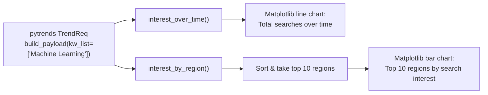

# Google Search Analysis

A single Jupyter notebook that uses `pytrends` (the unofficial Google Trends API) to pull search-interest data for the keyword "Machine Learning" and plots interest over time and interest by region (top 10 countries/regions) with Matplotlib.

## Tech stack

- Python
- pandas
- pytrends (`TrendReq`) for querying Google Trends
- Matplotlib (`fivethirtyeight` style) for line and bar charts
- Jupyter Notebook

## Architecture

## Setup / How to run

The notebook fetches data live from Google Trends at run time, so no local dataset is needed, but an internet connection is required (and pytrends queries can be rate-limited by Google).

1. Install dependencies: `pip install pandas pytrends matplotlib`
2. Open and run `Google search analysis.ipynb` in Jupyter.
